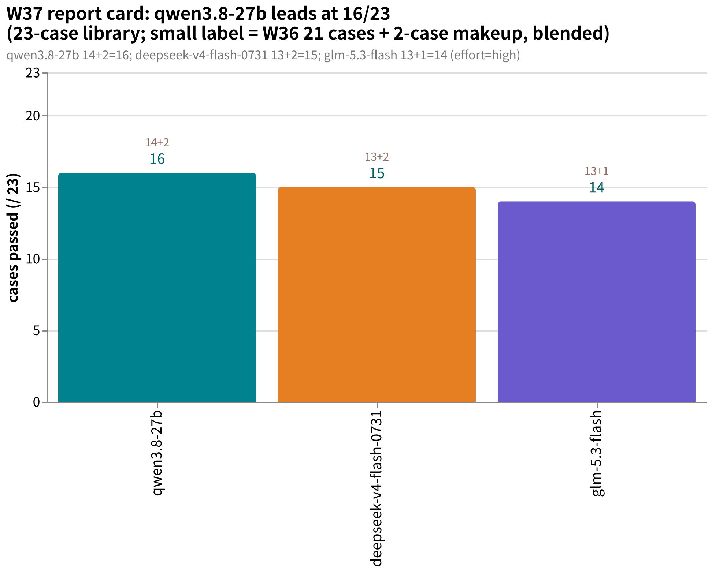
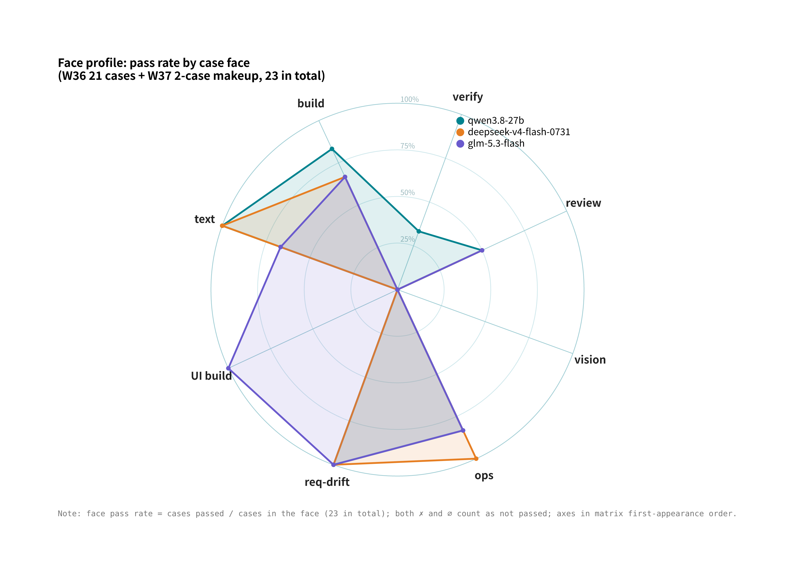
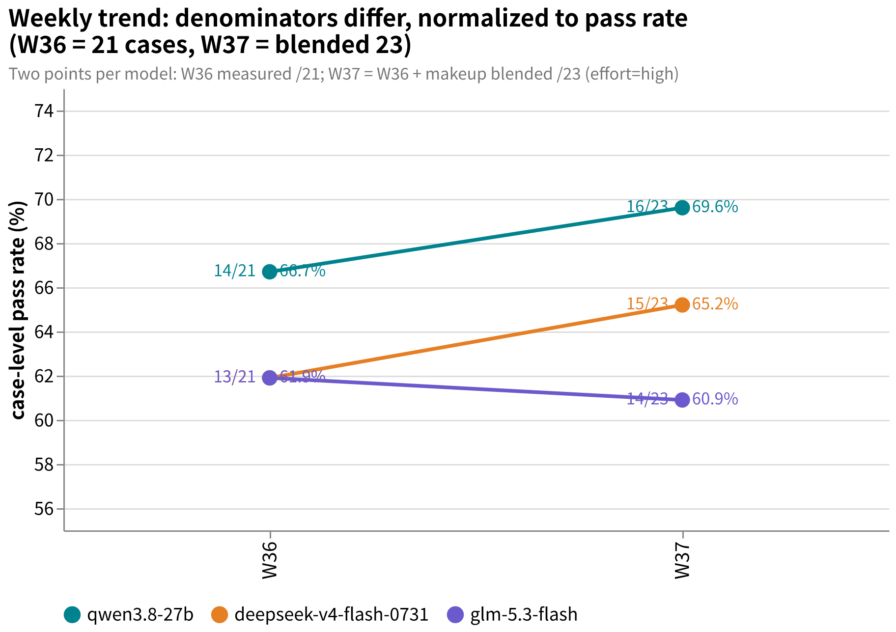

# amber-crof

Public weekly benchmark results of [CrofAI](https://crof.ai/) models against the private AMBER case suite.

[中文 README](README.md)

## What this is

- Weekly (plus ad-hoc) runs of the AMBER agentic case suite (build / ops / review / vision / requirement-drift) against models served by crof.ai. **Results are always public; the cases never are.**
- AMBER spec and case-authoring tools live at [getaskclaw/amber](https://github.com/getaskclaw/amber); the case contents themselves are private.
- Sister repos: [amber-ollama](https://github.com/getaskclaw/amber-ollama) (Ollama Cloud weekly), [amber-gpt](https://github.com/getaskclaw/amber-gpt) (GPT effort-band weekly), [amber-devin](https://github.com/getaskclaw/amber-devin) (Devin lane), [amber-deepseek](https://github.com/getaskclaw/amber-deepseek) (official DeepSeek lane), [amber-commandcode](https://github.com/getaskclaw/amber-commandcode) (CommandCode lane), [amber-opencode](https://github.com/getaskclaw/amber-opencode) (OpenCode Go lane), [amber-workbuddy](https://github.com/getaskclaw/amber-workbuddy) (WorkBuddy ACP lane), [amber-doubao](https://github.com/getaskclaw/amber-doubao), [amber-goldenpotato](https://github.com/getaskclaw/amber-goldenpotato), [amber-kimi](https://github.com/getaskclaw/amber-kimi), [amber-stepfun](https://github.com/getaskclaw/amber-stepfun).
- We are paying CrofAI customers, unaffiliated with the vendor. This is an independent community measurement.

## Publishing red lines (a violation means retract-and-correct)

1. **We publish**: scores, aggregates, cost, speed, and qualitative behavioral verdicts.
2. **We never publish**: case contents, raw model transcripts, or grading oracles. Model outputs can echo the prompts, so raw outputs never leave the private zone.
3. **Every issue pins**: model id, effort, UTC time window, harness identity, and per-case bundle hashes — checkable against the public hash manifest in [amber](https://github.com/getaskclaw/amber), so anyone can verify the case set did not change.
4. **Case IDs and suite structure stay private**: public results refer to cases only by stable aliases (A-xxxxxxxx, hash-derived) plus bundle hashes; internal case IDs, variant names, and task descriptions never appear.
5. **Tone = community measurement**: we report numbers and observed behavior, we don't attack vendors; findings are reproduced before publication.

## How to read results

- One case, one paper; a case passes only when all required checks are green (bonus checks excluded). Multi-variant cases pass only if every variant is green.
- n=1 single runs; noise exists. Occasional empty responses are retried per protocol and annotated in the issue.
- Cost uses the server-side `usage.cost` field returned by crof. Prices are snapshots from crof.ai/pricing at publication time; the live page wins.

## Charts

- **Report card** (2026-W37, blended 23-case tally = W36 21 cases + 2-case makeup): qwen3.8-27b leads the lane at 16/23, deepseek-v4-flash-0731 15/23, glm-5.3-flash 14/23 (makeup A-8c909d0a at 6/7, one check short).
  
- **Face profile** (W36 21-case matrix ∪ W37 2-case makeup, grouped by face): only qwen3.8-27b passes a verify-face case (1/3, incl. the first-ever 15/15 on A-a317e74b); glm-5.3-flash holds crof's only UI-build pass; all three fail the vision face.
  
- **Weekly trend** (W36 to W37, normalized to pass rate as the denominators differ): qwen3.8-27b 66.7%→69.6%, d4f-0731 61.9%→65.2%, glm-5.3-flash 61.9%→60.9%.
  

## Results index

| Issue | Content | Verdict |
|---|---|---|
| [2026-W36](results/2026-W36.md) | Five models, full library: d4f-0731 / d4f-vision-exp / glm-5.3-flash / qwen3.8-27b / qwen3.5-9b | qwen3.8-27b 14/21 leads (ties anchor at 14/21); glm-5.3-flash 13/21 incl. crof's first UI-case pass; four cases fail everyone; same-named glm-5.3-flash differs across vendors |
| [2026-W37](results/2026-W37.md) | Makeup: the 2 new ops cases (complete the 23-case set) | qwen3.8-27b 16/23 ties #3 (was a #2 tie at publication; the board was re-seeded since); d4f-0731 15/23; glm-5.3-flash 14/23 drops off the podium; 6 papers cost $0.044 |

## Analysis notes

- [Model-identity fingerprints: nine-axis nearest-neighbor analysis of the CrofAI lanes (2026-09)](docs/model-identity-cosine-2026-09.en.md) — the behavioral counterpart to third-party wire-level findings, computed from published score matrices: `glm-5.3-flash`'s fingerprint sits closest to `deepseek-v4.1-flash`, not its namesake. [中文](docs/model-identity-cosine-2026-09.md)

## Disclaimer

Independent, small-sample testing; not procurement advice. Lineup and pricing change without notice — see [crof.ai/pricing](https://crof.ai/pricing).
