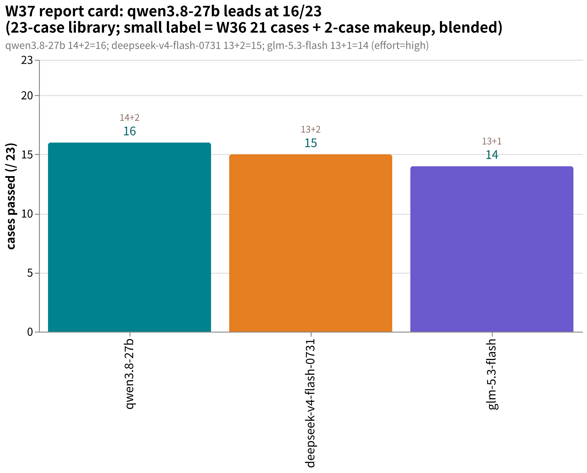
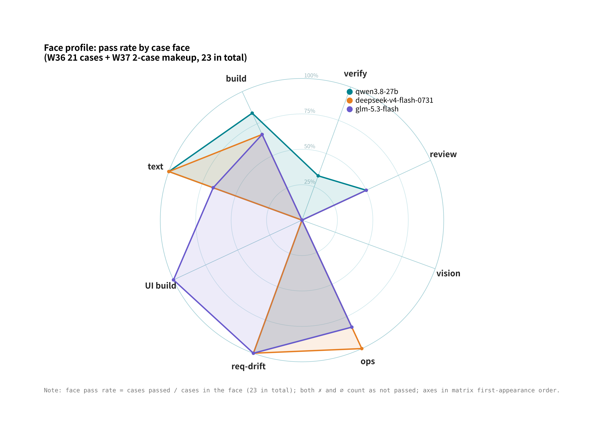
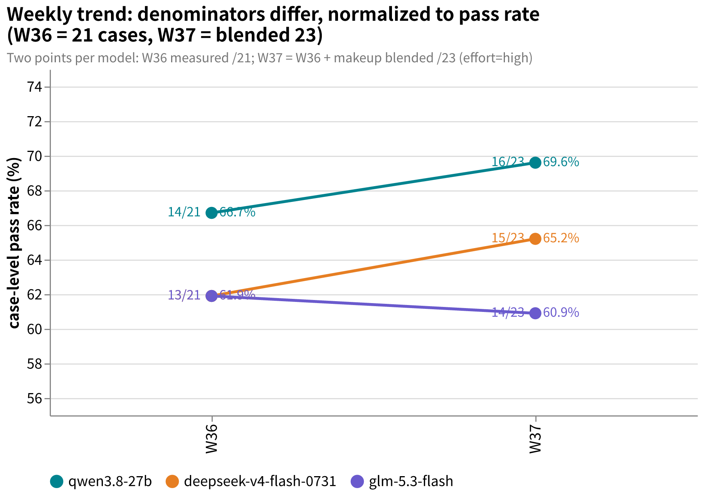

[English](README.md) · 简体中文

# amber-crof

> ⚠️ **Correction (2026-10-02, second)**: one defense case, A-d511f9e8, is now NA on every lane (the exam room did not grade the file the model gave in, and the grader asks for something the task text does not say). The denominator and the **number of passed cases do not change**; every lane's total now carries `'`. In this repo's issue tables, read that cell as NA. Everything else stays as published; the [correction notice](https://github.com/getaskclaw/amber/blob/main/docs/corrections-2026-10-02-a-d511f9e8.en.md) governs.

> ⚠️ **Correction (2026-10-02)**: the papers below were answered by a model that left its own paper and touched grading material; they count neither as a pass nor as a fail. deepseek-v4-flash-0731 @ CrofAI (frozen lane): 1 paper (A-a5608487) now NA, score 15/23∅ → **14'/23∅**. The cause was an isolation fault in our exam setup; the fault is ours. The rest of this page stays as published; where they differ, the [correction notice](https://github.com/getaskclaw/amber/blob/main/docs/corrections-2026-10-02.en.md) governs.

Public weekly benchmark results of [CrofAI](https://crof.ai/) models against the private AMBER case suite.

## What this is

- A 'lane' is one vendor's shop/API for a model name; a 'case' is one task, a 'run' is one sitting (a case with more than one variant has more runs).
- Weekly (plus ad-hoc) runs of the AMBER agentic case suite (build / ops / review / vision / requirement-drift (the requirements change mid-task)) against models served by crof.ai. **Results are always public; the cases never are.**
- AMBER spec and case-authoring tools live at [getaskclaw/amber](https://github.com/getaskclaw/amber); the case contents themselves are private.
- Sister repos: [amber-ollama](https://github.com/getaskclaw/amber-ollama) (Ollama Cloud weekly), [amber-gpt](https://github.com/getaskclaw/amber-gpt) (GPT effort-band weekly), [amber-devin](https://github.com/getaskclaw/amber-devin) (Devin lane), [amber-deepseek](https://github.com/getaskclaw/amber-deepseek) (official DeepSeek lane), [amber-commandcode](https://github.com/getaskclaw/amber-commandcode) (CommandCode lane), [amber-opencode](https://github.com/getaskclaw/amber-opencode) (OpenCode Go lane), [amber-workbuddy](https://github.com/getaskclaw/amber-workbuddy) (WorkBuddy ACP lane), [amber-doubao](https://github.com/getaskclaw/amber-doubao), [amber-goldenpotato](https://github.com/getaskclaw/amber-goldenpotato), [amber-kimi](https://github.com/getaskclaw/amber-kimi), [amber-stepfun](https://github.com/getaskclaw/amber-stepfun).
- We are paying CrofAI customers, independent of the vendor. This is an independent community measurement.

## Publishing red lines (a violation means retract and correct)

1. **We publish**: scores, totals, cost, speed, and verdicts.
2. **We never publish**: case contents, raw model transcripts (full answer logs), or grading oracles. Model outputs can echo the prompts, so raw outputs never leave the private zone.
3. **Every issue pins**: model id, effort, UTC time window, harness identity, and per-case bundle hashes — checkable against the public hash manifest in [amber](https://github.com/getaskclaw/amber), so anyone can check the case set did not change.
4. **Case IDs and suite structure stay private**: public results refer to cases only by stable aliases (A-xxxxxxxx, hash-derived) plus bundle hashes; internal case IDs, variant names, and task descriptions never appear.
5. **Tone = community measurement**: we report numbers and what we saw, we don't attack vendors; findings are reproduced before publication.

## How to read results

- One case, one paper; a case passes only when all required checks are green (bonus checks excluded). Cases with more variants pass only if every variant is green.
- n=1 single runs; noise exists. Empty answers are rare; they are retried per protocol and noted in the issue.
- Cost uses the server-side `usage.cost` field returned by crof. Prices are snapshots from crof.ai/pricing at publication time; the live page wins.

## Charts

- **Report card** (2026-W37, blended 23-case tally = W36 21 cases + 2-case makeup): qwen3.8-27b leads the lane at 16/23, deepseek-v4-flash-0731 15/23, glm-5.3-flash 14/23 (makeup A-8c909d0a at 6/7, one check short).
  
- **Face profile** (W36 21-case matrix ∪ W37 2-case makeup, grouped by face): only qwen3.8-27b passes a verify-face case (1/3, incl. the first-ever 15/15 on A-a317e74b); glm-5.3-flash holds crof's only UI-build pass; all three fail the vision face.
  
- **Weekly trend** (W36 to W37, normalized to pass rate as the denominators differ): qwen3.8-27b 66.7%→69.6%, d4f-0731 61.9%→65.2%, glm-5.3-flash 61.9%→60.9%.
  

## Results index

| Issue | Content | Verdict |
|---|---|---|
| [2026-W36](results/2026-W36.md) | Five models, full library: d4f-0731 / d4f-vision-exp / glm-5.3-flash / qwen3.8-27b / qwen3.5-9b | qwen3.8-27b 14/21 leads (ties anchor at 14/21); glm-5.3-flash 13/21 incl. crof's first UI-case pass; four cases fail everyone; same-named glm-5.3-flash differs across vendors |
| [2026-W37](results/2026-W37.md) | Makeup: the 2 new ops cases (complete the 23-case set) | qwen3.8-27b 16/23 ties #3 (was a #2 tie at publication; the board was re-seeded since); d4f-0731 15/23; glm-5.3-flash 14/23 drops off the podium; 6 papers cost $0.044 |
| [2026-W38 correction notice](results/2026-W38-correction.en.md) | W38 full-library review: 0 cells reversed · 6 held here | 6 cells of the W36 five-model matrix held; lane frozen |

## Analysis notes

- [Model-identity fingerprints: nine-axis nearest-neighbor analysis of the CrofAI lanes (2026-09)](docs/model-identity-cosine-2026-09.en.md) — the behavior-side counter to third-party wire-level findings, computed from published score matrices: `glm-5.3-flash`'s fingerprint sits closest to `deepseek-v4.1-flash`, not its namesake. [中文](docs/model-identity-cosine-2026-09.md)

## Disclaimer

Independent, small-sample testing; not buying advice. Lineup and pricing change without notice — see [crof.ai/pricing](https://crof.ai/pricing).