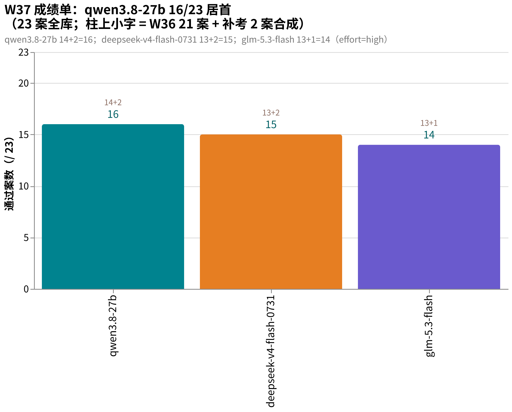
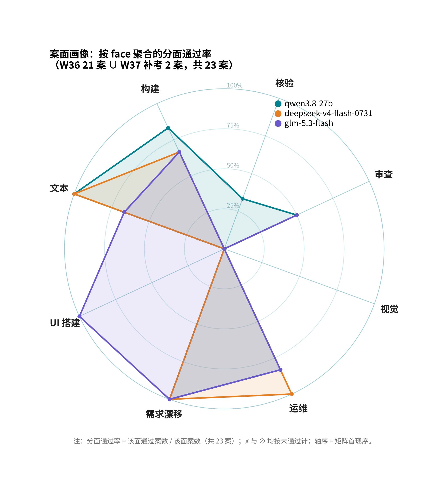
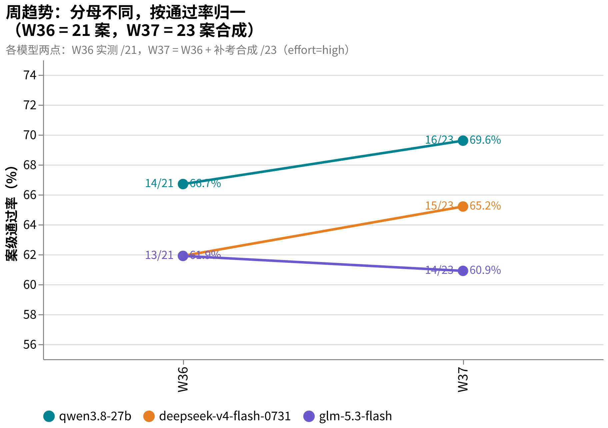

# amber-crof

用 AMBER 私有题库对 [CrofAI](https://crof.ai/) 在售模型做的公开周测结果仓。

[English README](README.en.md)

## 这是什么

- 每周（外加不定期触发）用 AMBER 案例库对 crof.ai 的模型跑一轮，**结果永远公开，题目永不公开**。
- AMBER 是 agentic 实战题库（施工/运维/审查/视觉/需求漂移），规范与制题工具见 [getaskclaw/amber](https://github.com/getaskclaw/amber)；考题本体私有。
- 姐妹仓：[amber-ollama](https://github.com/getaskclaw/amber-ollama)（Ollama Cloud 周测）、[amber-gpt](https://github.com/getaskclaw/amber-gpt)（GPT 档位周测）、[amber-workbuddy](https://github.com/getaskclaw/amber-workbuddy)（WorkBuddy ACP 道）。
- 我们是 crof 的付费用户，与 CrofAI 无隶属关系；这是独立第三方社区周测。

## 红线（发布纪律，违反即撤稿更正）

1. **只公开**：分数、聚合统计、成本、速度、定性行为裁决。
2. **永不公开**：题目内容、模型原始输出（transcript）、判分逻辑（oracle）。模型复述会带出题目原文，所以原始输出一律不出私域。
3. **每期钉死**:model id、effort、UTC 时间窗、harness 标识、每案 bundle 哈希——对照 [amber](https://github.com/getaskclaw/amber) 公开哈希清单，任何人可验证题目集未被更换。
4. **案号与题目结构属私有面**：公开结果里案例只用稳定别名（A-xxxxxxxx，哈希派生）+bundle 哈希作句柄；内部案号、变体名、题目描述永不出现。
5. **基调 = 社区周测**：陈述数字与观察到的行为，不攻击厂商；发现问题先可复现再发布。

## 怎么读结果

- 一案一卷；required checks 全绿才算过（bonus 不计入）。多卷案例（一案多变体）全绿才算一案过。
- n=1 单次，存在噪声；偶发空响应按规则补考重放，并在当期文中标注。
- 成本以 crof 响应里 `usage.cost` 的服务端账单口径为准；价格为发布时 crof.ai/pricing 快照，实时价以官网为准。
- 对照列「frontier ref」= 我们内部同题同档的 OpenAI 前沿模型参考席位，仅作锚点，不构成对该厂商的评价。

## 图说数据

- **本期成绩单**（2026-W37，23 案合成口径 = W36 21 案 + 补考 2 案）：qwen3.8-27b 16/23 居首，deepseek-v4-flash-0731 15/23，glm-5.3-flash 14/23（补考 A-8c909d0a 6/7 差一钉）。
  
- **案面画像**（W36 21 案矩阵 ∪ W37 补考 2 案，按 face 聚合）：仅 qwen3.8-27b 在核验面有通过（1/3，含 A-a317e74b 史上首个 15/15）；glm-5.3-flash 握有 crof 唯一 UI 案通过；视觉面三家全挂。
  
- **周趋势**（W36→W37，分母不同按通过率 % 归一）：qwen3.8-27b 66.7%→69.6%，d4f-0731 61.9%→65.2%，glm-5.3-flash 61.9%→60.9%。
  

## 结果索引

| 期 | 内容 | 结论 |
|---|---|---|
| [2026-W36](results/2026-W36.md) | 五模型全库：d4f-0731 / d4f-vision-exp / glm-5.3-flash / qwen3.8-27b / qwen3.5-9b | qwen3.8-27b 14/21 居首（追平锚点 14/21）；glm-5.3-flash 13/21 含 crof 首个 UI 案通过；四案全员阵亡；同名 glm-5.3-flash 跨厂商能力不同 |
| [2026-W37](results/2026-W37.md) | 新增 2 运维案补考（补齐 23 案） | qwen3.8-27b 16/23 并列第二；d4f-0731 15/23;glm-5.3-flash 14/23 跌出前三；6 卷成本 $0.044 |

## 免责

独立测试，样本量小，不构成采购建议。厂商阵容与价格随时变动，以 [crof.ai/pricing](https://crof.ai/pricing) 实时页为准。
